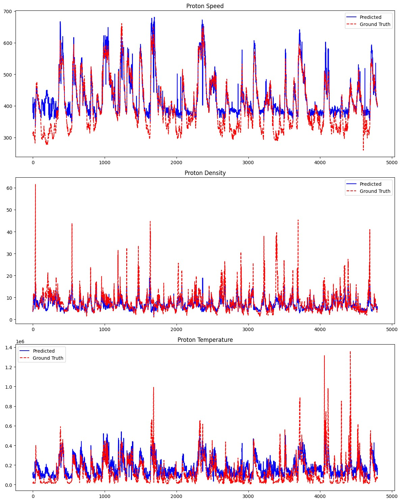
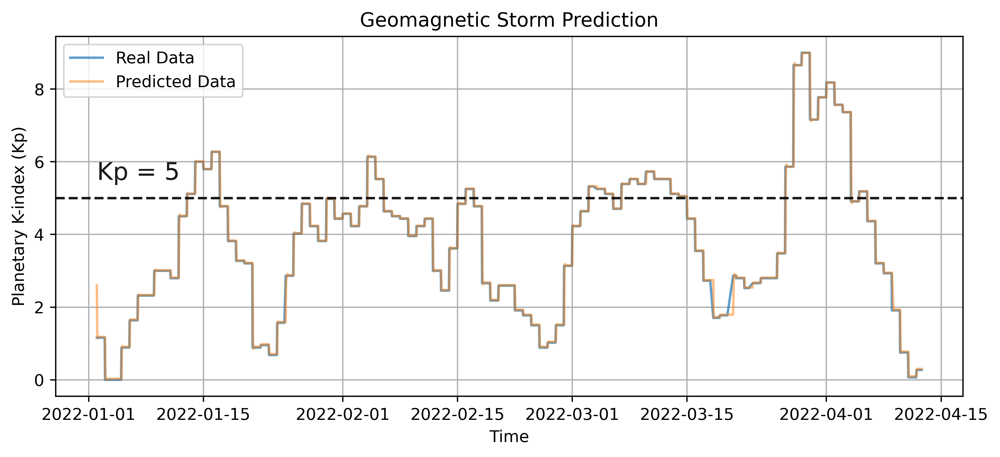

<div align="center">

# GEM — Geomagnetic Event Monitoring

**An anomaly-aware machine-learning pipeline for predicting geomagnetic-storm signals from raw DSCOVR spectra.**

[](https://www.spaceappschallenge.org/2023/find-a-team/taitatumu/?tab=project)
[](https://www.python.org/)

**Team TAITATUMU · NASA International Space Apps Challenge 2023**

[Project Demo Presentation](https://docs.google.com/presentation/d/1osTFOrglSblHkPrFA8QhS8mlf9VcaXHwkzbnW6JPDWw/edit#slide=id.g288c6e621b2_2_23)

</div>

## Project Summary

Geomagnetic storms can disrupt satellite operations, GPS, radio communication, power grids, and space missions. The Deep Space Climate Observatory (DSCOVR) provides valuable upstream solar-wind measurements, but its raw spectral data can occasionally contain faults and anomalous observations.

Instead of discarding those observations, our project explores whether they can be classified, interpreted, and utilized to predict solar wind properties. By leveraging all available open data—both "normal" and "abnormal" spectral data—our pipeline predicts solar wind density, temperature, and velocity. Subsequently, these predicted solar wind parameters are used to forecast the Planetary K-index (Kp), determining the occurrence and duration of geomagnetic storms. 

Our system provides early warnings for geomagnetic storms to reduce risks to terrestrial and orbital systems. In summary, our project focuses on:
1. Geomagnetic storm prediction based on the Kp index.
2. Full utilization of open data through anomaly detection.

## Pipeline Architecture

<div align="center">
  
</div>

This repository is organized into a three-stage sequential workflow:

1. **Module 1 (`01_anomaly_detection/`)**: 
   Classifies each DSCOVR spectrum as normal or anomalous. By identifying anomalies, we prevent corrupted input from degrading downstream models, instead modeling them explicitly.
   *Result*: Because the dataset is heavily imbalanced with mostly normal signals, our primary focus is successfully catching the rare "abnormal" signals (Recall). The model achieves a high recall (0.8056) for abnormal data, effectively preventing corrupted input from silently degrading the downstream steps.
   <div align="center">
     
   </div>
   
2. **Module 2 (`02_solar_wind_estimation/`)**: 
   Estimates three core physical properties from the raw spectra:
   - Proton speed (velocity)
   - Proton density
   - Proton temperature
   
   *Result*: The regression models successfully reconstruct physical solar wind parameters from raw spectra with exceptionally high accuracy (R-squared: 0.9960).
   <div align="center">
     
   </div>
   
3. **Module 3 (`03_kp_forecasting/`)**: 
   A time-series prediction module (using a Bidirectional Long Short-Term Memory network, Bi-LSTM) that forecasts the next hour's Kp index based on the previous hours of estimated solar-wind values. A predicted $Kp \geq 5$ is classified as a geomagnetic storm event.
   
   *Result*: The Bi-LSTM achieves strong predictive performance, successfully capturing the occurrence and severity of Kp index peaks.
   <div align="center">
     
   </div>

## Repository Structure

```text
.
├── 01_anomaly_detection/         # Module 1: Anomaly classification notebooks & scripts
├── 02_solar_wind_estimation/     # Module 2: Regression models for Solar Wind properties
├── 03_kp_forecasting/            # Module 3: Time-series forecasting for the Kp index
├── docs/                         
│   └── The Oracle of DSCOVR.pptx # Original presentation deck
├── requirements.txt              # Project dependencies
└── README.md                     # You are here
```

## Getting Started

### 1. Environment Setup
It is recommended to use a virtual environment or conda to run this repository.
```bash
python -m venv venv
source venv/bin/activate  # On Windows use `venv\Scripts\activate`
pip install -r requirements.txt
```

### 2. Exploring the Models
Because this repository preserves the original hackathon codebase, the logic is primarily contained within Jupyter Notebooks (`.ipynb`) inside each module folder. 

- Navigate to `01_anomaly_detection/` to review how spectral data is labeled and classified.
- Navigate to `02_solar_wind_estimation/` to see the XGBoost and Ridge models mapping spectra to solar wind parameters.
- Navigate to `03_kp_forecasting/` to view the PyTorch implementation of the sequence-to-sequence RNN models forecasting the final Kp index.

## Team
- Chao-Sheng Hung
- Wei-Yi Hsu
- Guan-Yong Xiong
- Hung-Yi Chen
- Hoi-Lam Lou
